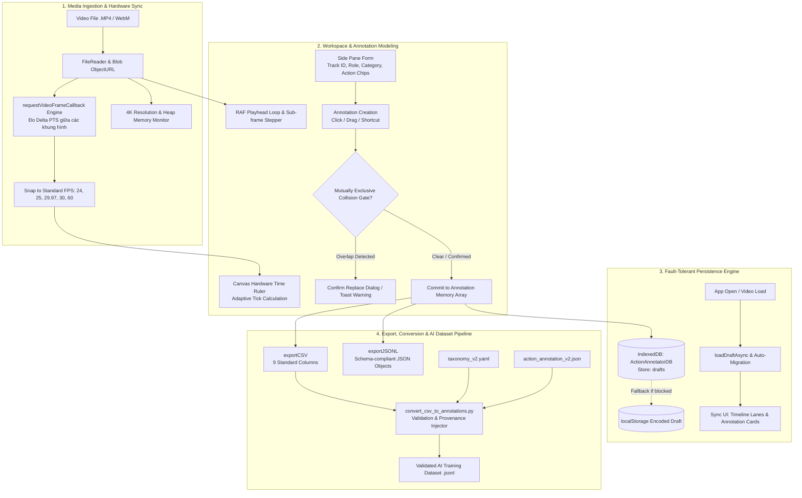

# Multimodal Action Annotator (Đánh Nhãn Hành Vi Đa Tầng)

> **Công cụ gán nhãn hành vi đa phương thức (Body, Facial, Audio) chuyên dụng cho video bài giảng và phân tích cử chỉ con người.**  
> *Chạy 100% Client-Side trên trình duyệt — Không cần cài đặt server, không phụ thuộc thư viện nặng, bảo mật dữ liệu tuyệt đối.*

---

## 1. Tổng Quan & Điểm Nổi Bật

**Multimodal Action Annotator** là công cụ chuyên dụng được thiết kế nhằm giải quyết bài toán thiếu hụt dữ liệu nhãn hành vi chi tiết trong nghiên cứu thị giác máy tính và AI tương tác (Human-Computer Interaction). Công cụ cung cấp một môi trường tương tác trực quan, mượt mà với hiệu năng cao, hỗ trợ phân cấp hành vi từ mức chuyển động cơ thể (Locomotion, Gestures) đến biểu cảm khuôn mặt (Facial) và tín hiệu âm thanh/giọng nói (Audio/Vocal).

### Tính năng chính:
- **Đa phương thức (Multimodal Taxonomy)**: Tích hợp sẵn 6 nhóm hành vi chuẩn và cho phép tùy biến/mở rộng không giới hạn (Body, Facial, Audio, Custom).
- **Hỗ trợ Đa nhân vật (Multi-Track / Multi-Person)**: Đánh nhãn song song nhiều đối tượng trên cùng khung hình với `Track ID` và `Role` (Lecturer, Audience, Unknown).
- **Tự động nhận diện FPS thực tế**: Sử dụng API hiện đại `requestVideoFrameCallback` để đo chính xác tốc độ khung hình (24, 25, 29.97, 30, 60 fps) thay vì gán cứng 30 fps, loại bỏ hoàn toàn lệch pha khung hình.
- **Timeline Đa Làn Tương Tác**: Vẽ trực tiếp bằng Canvas tăng tốc phần cứng, hỗ trợ kéo chuột tạo khoảng (drag-to-create), co giãn 2 đầu (resize handle), và di chuyển khối nhãn.
- **Kiểm soát xung đột thời gian (Temporal Collision Detection)**: Ngăn chặn và cảnh báo việc đánh nhãn chồng lấn đối với các nhóm hành vi đơn nhãn (`is_mutually_exclusive = true`).
- **Lưu trữ dung lượng lớn với IndexedDB**: Thay thế giới hạn 5MB của `localStorage` bằng IndexedDB, cho phép lưu hàng chục nghìn nhãn của các video dài mà không bao giờ mất dữ liệu.
- **Cơ chế quản lý bộ nhớ an toàn**: Cảnh báo video 4K để tránh tràn RAM, tự động thu hồi Blob URL khi nạp video mới hoặc tải lại trang.
- **Hỗ trợ Song ngữ (i18n)**: Chuyển đổi linh hoạt giữa Tiếng Việt và Tiếng Anh chỉ với một cú nhấp.
- **Chuẩn hóa Export/Import**: Xuất định dạng CSV 9 cột và JSONL tương thích hoàn toàn với JSON Schema kiểm duyệt học máy.

---

## 2. Kiến Trúc Pipeline Xử Lý (Processing Pipeline)



### Chi tiết các chặng trong Pipeline:

1. **Media Ingestion & Frame-Rate Detection**:
   - Khi chọn file video, một Blob URL được tạo (`URL.createObjectURL`). Nếu trước đó có video đang mở, URL cũ sẽ được giải phóng ngay (`URL.revokeObjectURL`) để hoàn trả GPU/RAM.
   - Hàm `detectFps(videoEl)` phân tích chuỗi khung hình qua `requestVideoFrameCallback`, tính toán delta thời gian thực tế và chuẩn hóa về tần số tiêu chuẩn gần nhất (ví dụ: 29.97 -> 30, 23.98 -> 24). Nhờ đó các thao tác lùi/tiến 1 khung hình (phím `,` và `.`) luôn trúng chính xác ranh giới khung hình.
   - Nếu video có kích thước >= 3840 x 2160 (4K), hệ thống tự động đưa ra cảnh báo khuyên dùng bản 720p/1080p để bảo toàn tài nguyên máy tính.

2. **Multi-Track & Multi-Modal Annotation**:
   - Người dùng gán nhãn theo từng phân loại (Category) thuộc các phương thức khác nhau: cử chỉ thân thể (Body), nét mặt (Facial), lời nói (Audio).
   - Định danh đối tượng qua trường `Track ID` (1, 2, 3...) và `Role` (Giảng viên, Khán giả, Chưa rõ).
   - Kiểm tra xung đột thời gian (`checkTemporalCollision`): Nếu nhóm hành vi mang tính đơn nhãn loại trừ lẫn nhau (`is_mutually_exclusive = true`), hệ thống ngăn chặn việc tạo 2 trạng thái mâu thuẫn đồng thời trên cùng một nhân vật.

3. **High-Capacity Persistence Engine**:
   - Dữ liệu được ghi tự động vào `IndexedDB` sau mỗi thao tác (thêm, sửa, xóa, kéo dãn). 
   - Không bị chặn bởi hạn mức 5MB như `localStorage`, cho phép làm việc bền bỉ với hàng ngàn đoạn hành vi.
   - Hệ thống tự động di chuyển (migrate) dữ liệu cũ từ `localStorage` lên `IndexedDB` ngay khi khởi động.

4. **Schema Validation & Dataset Conversion**:
   - Dữ liệu có thể xuất ra file CSV hoặc JSONL.
   - Script `convert_csv_to_annotations.py` kiểm thực chặt chẽ nhãn dựa trên file cấu hình `taxonomy_v2.yaml` và kiểm duyệt bằng JSON Schema `action_annotation_v2.json` nhằm đảm bảo không có nhãn rác hay nhãn sai cấu trúc lọt vào mô hình AI.

---

## 3. Cấu Trúc Thư Mục

```text
.
├── action_annotator_ui.html         # Toàn bộ ứng dụng Web UI (Single-file, no build needed)
├── README.md                        # Tài liệu hướng dẫn sử dụng & Pipeline (file này)
├── configs/
│   └── taxonomy_v2.yaml             # Cấu hình danh mục Taxonomy chuẩn
├── schemas/
│   └── action_annotation_v2.json    # JSON Schema kiểm thực dữ liệu gán nhãn
├── scripts/
│   └── convert_csv_to_annotations.py# Công cụ CLI chuyển đổi CSV sang JSONL đạt chuẩn
└── data/
    └── action_annotation_template.csv# File CSV mẫu có sẵn dữ liệu ví dụ
```

---

## 4. Hướng Dẫn Sử Dụng Nhanh

### Bước 1: Khởi động công cụ
Không cần cài đặt Node.js hay web server phức tạp. Bạn chỉ cần:
- Nhấp đúp chuột vào file `action_annotator_ui.html` để mở bằng bất kỳ trình duyệt hiện đại nào (Google Chrome, Microsoft Edge, Firefox, Brave).

### Bước 2: Nạp video
1. Bấm nút **📁 Chọn Video (.MP4)** ở góc trên bên trái.
2. Chọn video bài giảng cần phân tích.
3. Hệ thống sẽ tự động đo FPS và hiển thị badge (ví dụ: `📹 30 fps`). Thanh thời gian sẽ tự động zoom vừa vặn với thời lượng video.

### Bước 3: Thao tác đánh nhãn hành vi
Có 2 cách đánh nhãn thuận tiện:

- **Cách 1: Kéo thả trên Timeline (Trực quan nhất)**
  1. Đưa chuột vào làn (lane) của nhóm hành vi tương ứng trên timeline.
  2. Giữ chuột trái và kéo từ thời điểm bắt đầu đến thời điểm kết thúc.
  3. Chọn hành động cụ thể ở danh sách thẻ bên phải và nhấn **+ Thêm Hành Vi (Enter)**.

- **Cách 2: Sử dụng phím tắt khi xem video**
  1. Bấm `Space` để phát / tạm dừng video.
  2. Đến thời điểm hành vi bắt đầu, nhấn phím `S` (Start).
  3. Đến thời điểm hành vi kết thúc, nhấn phím `E` (End).
  4. Bấm các phím số `1` - `9` để chọn nhanh hành động.
  5. Nhấn `Enter` để lưu đoạn hành vi.

### Bước 4: Đánh nhãn đa nhân vật (Multi-Track)
- Nếu trong khung hình có nhiều người (ví dụ: Giảng viên và Sinh viên/Khán giả):
  - Nhập số thứ tự nhân vật vào ô **Track ID (Nhân vật)** (Ví dụ: `1` cho giảng viên, `2` cho khán giả tương tác).
  - Chọn **Vai trò (Role)** phù hợp.
  - Khi xuất file, các nhãn sẽ giữ nguyên định danh để huấn luyện mô hình đa nhân vật.

### Bước 5: Xuất dữ liệu
- Bấm **Xuất CSV** để lưu file dữ liệu dạng bảng tính (dễ xem qua Excel / Pandas).
- Bấm **Xuất JSONL** để có file dữ liệu cấu trúc phục vụ trực tiếp cho mô hình Deep Learning.

---

## 5. Bảng Phím Tắt Tiện Ích

| Phím Tắt | Hành Động | Mô Tả |
|:---:|---|---|
| `Space` | Play / Pause | Phát hoặc tạm dừng video |
| `←` / `→` | Lùi / Tiến 1 giây | Di chuyển nhanh trên video |
| `,` (phẩy) | Lùi 1 khung hình (-1f) | Nhảy lùi chính xác $1/\text{fps}$ giây |
| `.` (chấm) | Tiến 1 khung hình (+1f) | Nhảy tiến chính xác $1/\text{fps}$ giây |
| `S` | Set Start | Lấy mốc thời gian hiện tại làm điểm bắt đầu |
| `E` | Set End | Lấy mốc thời gian hiện tại làm điểm kết thúc |
| `1` - `9` | Chọn nhanh hành động | Chọn hành động tương ứng theo thứ tự hiển thị |
| `Enter` | Thêm hành vi | Lưu đoạn hành vi vào danh sách và timeline |
| `Kéo chuột` | Tạo khoảng thời gian | Kéo trực tiếp trên làn timeline |
| `Kéo 2 đầu block` | Chỉnh sửa thời gian | Thay đổi mốc bắt đầu/kết thúc trực tiếp |

---

## 6. Chuyển Đổi & Kiểm Thực Dữ Liệu CLI

Sau khi hoàn tất quá trình gán nhãn và xuất ra file CSV, bạn có thể chạy script chuyển đổi để kiểm thực toàn diện:

```bash
python scripts/convert_csv_to_annotations.py \
    --csv data/annotations/your_exported_file.csv \
    --taxonomy configs/taxonomy_v2.yaml \
    --schema schemas/action_annotation_v2.json \
    --output data/annotations_v2.jsonl
```

### Đặc tả trường dữ liệu JSONL xuất ra:
```json
{
  "annotation_id": "ann_video_01_0001",
  "video_id": "video_01",
  "track_id": 1,
  "role": "lecturer",
  "start_seconds": 12.5,
  "end_seconds": 15.8,
  "category": "locomotion",
  "actions": ["walking"],
  "taxonomy_version": "v2.0-proposed",
  "annotator_id": "human_web_ui",
  "annotator_confidence": 1.0,
  "annotation_status": "draft",
  "review_status": "unreviewed",
  "revision": 0,
  "observability": "unknown",
  "notes": "Di chuyển về phía bảng đen"
}
```

---

## 7. Giấy Phép & Đóng Góp

Dự án phát triển phục vụ công tác nghiên cứu hành vi giảng viên và phân tích video thị giác máy tính. Mọi đóng góp hoặc báo cáo lỗi xin vui lòng mở Issue hoặc Pull Request trên repository.
